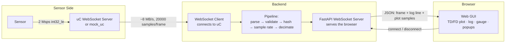

# Sensor Monitor


A web-based application that connects to a microcontroller (uC) over WebSocket,
collects a real-time sensor signal streamed at ~8 MB/s, validates and hashes
every frame, and visualises it in a browser GUI.

Built as a submission for the **TII-DERC Senior Software Engineer** technical
challenge (see `SW_Challenge.pdf` in this repository for the original brief).

---

## Table of Contents

- [Overview](#overview)
- [Architecture](#architecture)
- [Project Status](#project-status)
- [Requirements Traceability](#requirements-traceability)
- [Tech Stack](#tech-stack)
- [Repository Structure](#repository-structure)
- [Design Decisions & Assumptions](#design-decisions--assumptions)
- [Getting Started](#getting-started)
- [Continuous Integration](#continuous-integration)

---

## Overview

A microcontroller on a LAN runs a WebSocket server. As soon as a client
connects, it starts streaming sensor data at 2 Msps: each WebSocket packet
(frame) carries **20,000 samples**, each an `int32` little-endian value —
roughly 8 MB/s, ~100 frames/second.

This application is the WebSocket **client**. It:

1. Connects to the uC's WebSocket server from a URL entered by the user.
2. Parses each binary frame into samples, validates the sample count, and
   computes an **XXH3_128** hash of the raw payload.
3. Estimates the sample rate from consecutive frame arrival times.
4. Streams the processed signal to a browser GUI for a real-time,
   oscilloscope-style time-domain plot, plus a per-frame log and a live
   sample-rate gauge.
5. Surfaces connection lifecycle events (failed / dropped) as popups.

A **mock uC** (`mock_uc/`) is included so the whole pipeline can be built and
tested without physical hardware.

## Architecture

The backend acts as a WebSocket **client** to the uC and a WebSocket
**server** to the browser at the same time, on the same `asyncio` event loop:



Each incoming frame goes through a small pipeline of pure, independently
testable steps — parse the raw bytes, validate the sample count, hash the
payload, update the sample-rate estimate, and decimate the signal down to a
plot-friendly point count — before being pushed to the browser as JSON.

## Project Status

This repository is under active, incremental development (see commit
history). Current state:

**Backend — signal processing core**
- [x] Project scaffolding: `pyproject.toml`, `pytest`, `ruff`, coverage config
- [x] Mock uC WebSocket server + synthetic signal generator (`mock_uc/`)
- [x] Binary frame parsing (`int32_le` → NumPy, zero-copy)
- [x] Frame validation (sample-count check → drives the "red log line")
- [x] XXH3_128 hashing of the raw payload
- [x] Sample-rate estimation (EMA-smoothed, per-frame)
- [x] Plot decimation (min/max, oscilloscope-style envelope)
- [x] Shared data models (`ProcessedFrame`, `ConnectionEvent`)
- [x] 28 unit tests, 100% coverage on every module listed above

**Backend — service layer**
- [ ] WebSocket client / streaming pipeline wiring
- [ ] Ring buffer for received frames
- [ ] FastAPI app: `/ws` endpoint, static file serving, `/export` endpoint

**Frontend**
- [ ] Web GUI (HTML/CSS/vanilla JS): URL input, Connect/Disconnect, popups
- [ ] Real-time time-domain plot (uPlot)
- [ ] Per-frame log panel (red line on invalid frame count)
- [ ] Sample-rate gauge
- [ ] Frequency-domain (FFT) tab *(optional)*
- [ ] Data export (CSV/JSON) *(optional)*

**DevOps / Delivery**
- [x] CI: GitHub Actions running the full test suite with coverage on every push/PR
- [ ] Dockerfile + docker-compose (backend + mock uC)
- [ ] `docs/architecture.md`

## Requirements Traceability

Mapping the challenge's mandatory requirements to their implementation status:

| Requirement | Status | Implementation |
|---|---|---|
| Real-time time-domain plot | Planned | frontend (pending) + `plot_decimator.py` (done) |
| Per-frame log line, exact format | Backend ready | `ProcessedFrame.to_log_line()` |
| URL input + Connect/Disconnect | Planned | frontend (pending) |
| Popup on connection failure | Backend ready | `ConnectionEvent(kind="connect_failed")` |
| Popup on connection drop + re-enable Connect | Backend ready | `ConnectionEvent(kind="disconnected")` |
| Sample-rate gauge, measured per frame | Backend ready | `SampleRateEstimator` |
| Validate sample count; red log line on mismatch | Done | `frame_validator.py`, `ProcessedFrame.is_valid` |
| XXH3_128 hash of raw payload per frame | Done | `hashing.py` |
| Git commit history | Done | incremental commits, see `git log` |
| Runs on Ubuntu 24.04 / Fedora 42 or container | Planned | Docker (pending) |
| *(optional)* Frequency-domain plot (FFT) | Not started | — |
| *(optional)* Data export | Not started | — |

"Backend ready" means the module producing the data/event exists and is
unit-tested, but is not yet wired into a running server or rendered in a UI.

## Tech Stack

| Layer | Technology | Why |
|---|---|---|
| Backend language | Python 3.12 | async-first, strong typing support, fast to iterate |
| Web framework | FastAPI *(planned)* | native async WebSocket support on both client and server sides, needed to act as WS client (to the uC) and WS server (to the browser) simultaneously under a high-throughput stream |
| WebSocket client | `websockets` | connects to the uC as a client |
| Binary parsing | NumPy | zero-copy `int32_le` parsing and vectorised min/max decimation at ~100 frames/s |
| Hashing | `xxhash` (XXH3_128) | required by the spec, extremely fast on binary payloads |
| Frontend | HTML + CSS + vanilla JS *(planned)* | no framework overhead needed for the scope; keeps the app self-contained for offline LAN testing |
| Plot | uPlot *(planned, vendored offline)* | lightweight, canvas-based, built for high-frequency real-time updates |
| Testing | pytest, pytest-asyncio, pytest-cov | unit + async pipeline testing with coverage |
| Static analysis | ruff | fast linting, single tool for style + common bugs |
| Mock hardware | Python `asyncio` WebSocket server | develop and test the full pipeline without physical hardware |
| CI | GitHub Actions | automated tests + coverage on every push/PR |

## Repository Structure

```
SensorMonitorTII/
├── backend/
│   ├── app/
│   │   ├── frame_parser.py      # raw bytes -> NumPy int32 samples
│   │   ├── frame_validator.py   # sample-count validation
│   │   ├── hashing.py           # XXH3_128 of the raw payload
│   │   ├── sample_rate.py       # EMA-smoothed sample-rate estimator
│   │   ├── plot_decimator.py    # min/max decimation for the plot
│   │   └── models.py            # ProcessedFrame, ConnectionEvent
│   └── tests/                   # one test module per backend module
├── mock_uc/
│   ├── server.py                 # mock uC: WebSocket server
│   └── signal_generator.py       # synthetic signal (sine tones + noise)
├── .github/
│   ├── workflows/ci.yml          # test + coverage CI pipeline
│   └── scripts/build_job_summary.py  # renders the CI job summary
├── pyproject.toml                # pytest / coverage / ruff configuration
├── requirements.txt               # runtime dependencies
├── requirements-dev.txt           # + testing/lint dependencies
└── SW_Challenge.pdf                # original challenge brief
```

## Design Decisions & Assumptions

As permitted by the challenge conditions, assumptions made where the brief
was silent are documented here, together with the reasoning behind each
implementation decision:

1. **FastAPI over Flask.** The service must act as a WebSocket *client* (to
   the uC) and a WebSocket *server* (to the browser) at the same time, under
   a sustained ~8 MB/s stream. FastAPI's native `asyncio` support handles
   both roles on one event loop without extra runtime patching.

2. **NumPy for binary parsing.** `np.frombuffer` gives a zero-copy view of
   the raw payload as `int32_le` samples, keeping per-frame parsing cheap
   enough to sustain ~100 frames/second.

3. **Hash the raw payload, not the parsed samples.** The spec asks for an
   XXH3_128 hash of the *raw binary payload*. Hashing the bytes as received
   (rather than re-serialising parsed samples) avoids any dependency on
   endianness or parsing correctness and matches exactly what was received
   on the wire.

4. **Sample-count validation is a pure function.** `validate_frame()` takes
   only the payload and an expected count, and returns a small result
   object — no I/O, no logging side effects — so it is trivial to unit test
   and the "red log line" decision stays in one place.

5. **EMA-smoothed sample rate.** Frame arrival over a network is bursty;
   reporting the raw instantaneous rate would make the gauge jump around.
   An exponential moving average (configurable smoothing factor) keeps the
   reading stable while still reacting to real rate changes.

6. **Min/max decimation for the plot (oscilloscope technique).** Sending all
   20,000 samples per frame to the browser ~30–100 times/second is neither
   necessary nor smooth. Each frame is split into buckets and both the min
   and max of each bucket are kept, preserving the visual envelope (peaks
   and troughs) while cutting the point count by roughly 10x.

7. **Mock uC built first.** `mock_uc/` was implemented before the rest of
   the pipeline so that every downstream module could be developed and
   tested against a live, controllable WebSocket source — including an
   intentionally wrong `--samples` count, to exercise the "red log line"
   path without needing real hardware.

8. **Frontend plotting library vendored offline (planned).** The app is
   meant to be tested on a LAN without guaranteed internet access, so the
   plotting library will be bundled with the repository rather than loaded
   from a CDN.

9. **Test-first, I/O-free modules.** Every processing step (parsing,
   validation, hashing, sample-rate estimation, decimation) is a pure
   function or small stateful class with no network or filesystem access,
   so each one is covered by fast, deterministic unit tests independent of
   the WebSocket plumbing.

## Getting Started

### Prerequisites

- Python 3.12+
- (recommended) a virtual environment

### Setup

```bash
python -m venv .venv
source .venv/bin/activate        # Windows: .venv\Scripts\Activate.ps1
pip install -r requirements-dev.txt
```

### Run the tests

```bash
python -m pytest        # runs the full suite (28 tests)
python -m ruff check .  # lint
```

### Run the mock microcontroller

```bash
python -m mock_uc.server --fps 100 --port 8765
```

Flags:

| Flag | Default | Purpose |
|---|---|---|
| `--host` | `0.0.0.0` | bind address |
| `--port` | `8765` | bind port |
| `--fps` | `30` | frames/second (real uC is ~100; lowered by default so dev laptops keep up) |
| `--samples` | `20000` | samples per frame — set to something else (e.g. `19999`) to emit invalid frames on purpose |

> The full application (FastAPI server + web GUI) is still under
> development — see [Project Status](#project-status). This README will be
> updated with end-to-end run instructions once `backend/app/main.py` and
> the frontend land.

## Continuous Integration

Every push and pull request runs the **Sensor Monitor CI** workflow
(`.github/workflows/ci.yml`) on `ubuntu-24.04`:

1. **Checkout** the repository.
2. **Set up Python 3.12** with pip caching keyed on `requirements-dev.txt`.
3. **Install dependencies** from `requirements-dev.txt`.
4. **Run the full pytest suite with coverage**, producing a JUnit report
   (`test-results.xml`) and coverage reports in terminal, XML, JSON and HTML
   formats.
5. **Publish test results** to the PR/commit Checks tab via
   `dorny/test-reporter`.
6. **Build a job summary**: `.github/scripts/build_job_summary.py` reads the
   JUnit and coverage-JSON reports and renders a colour-coded Markdown
   summary (pass/fail badge, per-suite results table, per-file coverage
   table with a 🟢/🟡/🔴 traffic-light indicator) directly on the workflow
   run page.
7. **Upload artifacts**: the JUnit XML and the full coverage report
   (XML + JSON + HTML) are attached to the run for later inspection.

The coverage-JSON report is used (rather than the Cobertura XML) to key the
per-file table, since two source roots (`backend/app` and `mock_uc`) each
contain an `__init__.py` — the XML writer keys files by basename only and
the two would collide into a single, incorrect row.
