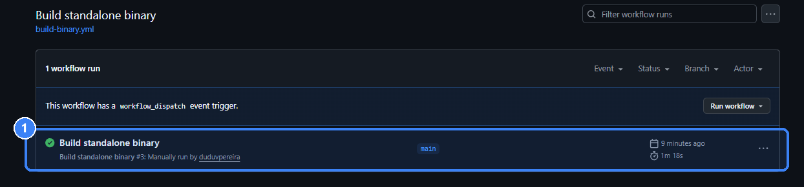
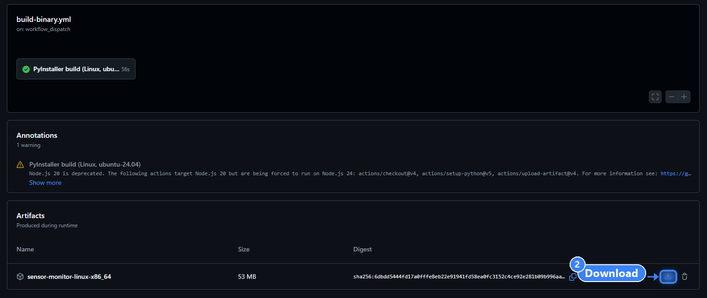

# Sensor Monitor

[](https://github.com/duduvpereira/SensorMonitorTII/actions/workflows/ci.yml)


A web-based application that connects to a microcontroller (uC) over WebSocket,
collects a real-time sensor signal streamed at ~8 MB/s, validates and hashes
every frame, and visualises it in a browser GUI.

Built as a submission for the **TII-DERC Senior Software Engineer** technical
challenge.

---

## Table of Contents

- [Getting Started](#getting-started)
  - [Run the standalone binary](#run-the-standalone-binary)
  - [Run with Docker](#run-with-docker)
  - [Run locally with Python](#run-locally-with-python)
- [Overview](#overview)
- [Architecture](#architecture)
- [Project Status](#project-status)
- [Requirements Traceability](#requirements-traceability)
- [Tech Stack](#tech-stack)
- [Repository Structure](#repository-structure)
- [Design Decisions & Assumptions](#design-decisions--assumptions)
- [Continuous Integration](#continuous-integration)

---

## Getting Started

There are three ways to run the application, and all of them end up serving
the same UI at <http://localhost:48000>:

| | What you need | Best for |
|---|---|---|
| [**Standalone binary**](#run-the-standalone-binary) | Nothing | the quickest way to just try it — download one file and run it |
| [**Docker**](#run-with-docker) | Docker Engine only | running or evaluating the app in an isolated, reproducible environment |
| [**Local Python**](#run-locally-with-python) | Python 3.12+ | developing, running the tests |

### Run the standalone binary

The fastest way to try the app: `sensor-monitor` is a single self-contained
executable (built with [PyInstaller](https://pyinstaller.org/)) that bundles
the interpreter, every dependency and the frontend into one file. No install
step of any kind — works even without Docker or a usable Python on the
machine.

**Get the binary** — a plain, public download, no GitHub account needed:

```bash
curl -LO https://github.com/duduvpereira/SensorMonitorTII/releases/download/standalone-latest/sensor-monitor
```

Or from a browser: [**Releases → standalone-latest**](https://github.com/duduvpereira/SensorMonitorTII/releases/tag/standalone-latest) →
download the `sensor-monitor` asset.

This is a rolling release: the `standalone-latest` tag always points at the
most recent successful build, republished by CI on every run of the
[**Build standalone binary**](https://github.com/duduvpereira/SensorMonitorTII/actions/workflows/build-binary.yml)
workflow — nothing to trigger by hand.

<details>
<summary>Alternative: get it from the workflow run directly instead of the release</summary>

Useful for a specific commit's build rather than the latest one. Note this
route needs a signed-in GitHub account to download from — even on a public
repo, that's a GitHub Actions artifact restriction, not something this repo
controls. The release download above has no such requirement.

1. Open the [**Build standalone binary**](https://github.com/duduvpereira/SensorMonitorTII/actions/workflows/build-binary.yml)
   workflow and click **①** the run you want:

   

2. On the run's summary page, scroll to **Artifacts** and click **②** to
   download `sensor-monitor-linux-x86_64`:

   

It's a zip; unzip it to get the `sensor-monitor` executable.

</details>

Or build it yourself on Linux instead:

```bash
./packaging/build.sh      # needs only python3 + pip; output: dist/sensor-monitor
```

**Run it:**

```bash
chmod +x sensor-monitor   # if it doesn't already have the execute bit
./sensor-monitor
```

Then open <http://localhost:48000> to see the GUI — it tries to open a
browser for you automatically, but that only works with a desktop session
(not over SSH or in WSL without a display, where opening it yourself is the
normal path anyway). The URL field is already pre-filled with the mock uC's
address, so pressing **Connect** is all that's left.

It starts the mock uC and the backend together in a single process (unlike
[`./run.sh`](#run-the-application), which supervises two) and checks both
ports before touching either. `./sensor-monitor --help` lists the flags
(`--port`, `--uc-port`, `--fps`, `--no-mock` for real hardware,
`--no-browser`, ...).

Built for **Linux x86_64**, compiled by CI on `ubuntu-24.04` — the same OS
version the challenge names as the evaluation target, so the build's glibc
is guaranteed compatible with it. `packaging/build.sh` has no Linux-specific
step, so building on macOS should work too, but only the Linux build is
what CI actually verifies end to end (it starts the binary and drives a
real frame through `/ws`, not just checks that PyInstaller exits 0 — see
[`.github/workflows/build-binary.yml`](.github/workflows/build-binary.yml)).

### Run with Docker

#### Prerequisites

Docker Engine with the Compose plugin — that is, `docker compose` (v2), not the
older standalone `docker-compose` binary. Nothing else: Python, the
dependencies and the mock microcontroller all live inside the image.

```bash
docker --version          # expect 24.x or newer
docker compose version    # expect v2.x
```

If those commands are not found, install Docker Engine from the **official
documentation for your distribution** — <https://docs.docker.com/engine/install/>
(direct links: [Ubuntu](https://docs.docker.com/engine/install/ubuntu/),
[Fedora](https://docs.docker.com/engine/install/fedora/)). A condensed,
copy-pasteable version of those steps for Ubuntu 24.04 and Fedora 42, including
the optional "run Docker without `sudo`" step, is kept in
[`docs/install-docker.md`](docs/install-docker.md).

#### Bring up the stack

From the repository root:

```bash
docker compose up --build
```

That builds one image and starts two containers from it:

<details>
<summary><strong>Two things to check before reporting this repo as broken</strong> — a permission error and a port conflict, both about the local Docker install, not the app.</summary>

**`permission denied ... /var/run/docker.sock`** — the current user isn't in
the `docker` group, so every Docker command needs `sudo`. Either prefix every
command in this section with `sudo`, or fix it once:

```bash
sudo usermod -aG docker $USER && newgrp docker
```

(full context in [`docs/install-docker.md`](docs/install-docker.md#optional-run-docker-without-sudo)).

**`failed to bind host port ... address already in use`** — the ports are
deliberately unusual (48000/48765, not 8000/8765 — 8765 in particular is the
`websockets` library's own quickstart example, so it collides more often
than you'd expect), but a leftover container from a previous run of *this*
project can still hold one of them. Compose's own error doesn't say which
process holds it or how to work around it, so check first:

```bash
sudo lsof -i :48000 -i :48765          # Linux/macOS
```

If either is taken, override the host port without touching any file —
the container-internal ports (and the `mock-uc:48765` address the two
containers use to reach each other) stay the same either way:

```bash
MOCK_PORT=8766 docker compose up --build
# then use ws://localhost:8766 from outside Docker, e.g. in demo_pipeline.py
```

</details>

| Service | Container | Port | Role |
|---|---|---|---|
| `app` | `sensor-monitor-app` | `48000` | FastAPI + Uvicorn, serves the GUI and the frontend WebSocket |
| `mock-uc` | `sensor-monitor-mock` | `48765` | the mock microcontroller, streaming at `--fps 100` (2 Msps) |

Then open <http://localhost:48000>. The URL field arrives pre-filled with
`ws://mock-uc:48765` — the mock's name on the Compose network — so you can press
**Connect** straight away.

> The uC connection is opened by the **backend**, not by the browser, so the URL
> is resolved inside the `app` container. `ws://localhost:48765` would point at
> the app container itself and fail; use the service name. Port 48765 is still
> published on the host so tools running outside Docker (such as
> `demo_pipeline.py`) can reach the mock.

Useful variations:

```bash
docker compose up --build -d      # detached
docker compose logs -f app        # follow the backend's logs
docker compose down               # stop and remove the containers
docker compose up --build --no-deps app   # app only, to use REAL hardware
```

To drive **real hardware**, start the `app` service alone (last line above —
`--no-deps` is what keeps Compose from pulling the mock in as well) and type the
board's own URL, `ws://<board-ip>:48765`, into the GUI. The app has no runtime
dependency on the mock.

To change the mock's frame rate, edit the `--fps` value in the `mock-uc`
service's `command:` in [`docker-compose.yml`](docker-compose.yml) and re-run
`docker compose up`.

### Run locally with Python

#### Prerequisites

- Python 3.12+
- (recommended) a virtual environment

#### Setup

**Linux / macOS** — `./setup.sh` finds a Python 3.12+ interpreter on the
machine (a plain `python3` isn't guaranteed to be new enough — see the note
below), creates `.venv` with it, and installs the dev dependencies:

```bash
chmod +x setup.sh   # the execute bit doesn't always survive a git clone/transfer
./setup.sh
source .venv/bin/activate
```

Run it without `sudo`. It only touches `.venv` and installs packages into it,
neither of which should be owned by root — if `python3.12 -m venv` itself
complains that `ensurepip` is unavailable, the fix is a system package
(`sudo apt install python3.12-venv` on Ubuntu/Debian), not running the whole
script as root.

**Windows, or by hand on any OS:**

```bash
python3 --version                # confirm 3.12+ before creating the venv
python3 -m venv .venv
source .venv/bin/activate        # Windows: .venv\Scripts\Activate.ps1
pip install -r requirements-dev.txt   # runtime deps + pytest/ruff
```

To install only what the application itself needs, use
`pip install -r requirements.txt`.

> **Interpreter older than 3.12?** Both entrypoints (`mock_uc.server` and
> `backend.app.main`) check the Python version at startup and fail with a
> clear message pointing back here, instead of a confusing `numpy>=2.0`
> resolution error during `pip install` or a subtler bug later. On Ubuntu,
> the `deadsnakes` PPA installs a newer interpreter side by side without
> touching the system one:
> ```bash
> sudo add-apt-repository -y ppa:deadsnakes/ppa && sudo apt update
> sudo apt install -y python3.12 python3.12-venv
> rm -rf .venv && python3.12 -m venv .venv && source .venv/bin/activate
> pip install -r requirements-dev.txt
> ```
> Ubuntu 24.04 and Fedora 42 both ship 3.12 by default, so this only comes up
> on an older or customized install. If reinstalling Python isn't an option,
> [Run with Docker](#run-with-docker) sidesteps the host's Python
> version entirely.

#### Run the application

**Linux / macOS — one command:** `./run.sh` starts the mock uC and the
backend together, tails both logs to the terminal, and cleans up on
`Ctrl-C`. It assumes `./setup.sh` has already created `.venv`.

```bash
./run.sh
```

Before starting anything, it:

- **imports the application in `.venv`'s Python and checks for errors** —
  a broken environment fails right here, with the real traceback on screen,
  instead of as a background process that dies a second later for a reason
  buried in a log file;
- **stops any leftover `mock_uc.server`/`backend.app.main` process from a
  previous run** that's still holding the ports — the scenario behind most
  `address already in use` reports (a closed terminal or a killed shell that
  never got to shut its children down cleanly). It only ever touches a PID
  whose own command line unmistakably names one of this project's modules,
  never anything else that happens to reuse a recycled PID.

Run `./run.sh --doctor` any time (nothing needs to be running first) for a
one-shot environment report — every Python interpreter found and its
version, whether `.venv` exists and what it has installed, whether ports
48000/48765 are free, and whether `git`/`docker` are on PATH. It is the
fastest way to answer "why won't this run on your machine" without a back
and forth of screenshots.

**By hand, in two terminals** (useful for `--reload` during development, or
on Windows):

```bash
# 1. In one terminal: start the mock microcontroller
python -m mock_uc.server --fps 60 --port 48765

# 2. In another terminal: start the backend (FastAPI + Uvicorn)
python -m uvicorn backend.app.main:app --reload --port 48000

# 3. In a web browser: open the GUI
#    http://localhost:48000
```

In the GUI, enter the uC's WebSocket URL — `ws://localhost:48765` for the mock
(pre-filled), or `ws://<board-ip>:48765` for real hardware — and press
**Connect**. The plot, the per-frame log and the sample-rate gauge start
updating immediately; **Disconnect** stops the stream and re-enables the input.

The **TD / FD** tabs above the plot switch between the time-domain waveform and
the FFT spectrum (dBFS against frequency). The switch takes effect on the next
frame without touching the uC connection, and the frame log keeps scrolling in
both views. With the mock uC, the FD view shows its two synthetic tones at
5 kHz and 50 kHz.

Two more read-outs sit at the bottom of the plot panel:

- **Peak** (FD only) — the dominant frequency and its magnitude, e.g.
  `50.0 kHz @ -66.6 dBFS`, updated every frame.
- **Power (RMS)** (both tabs) — the frame's RMS power in dBFS, so clipping
  (near 0 dB) is visible even while looking at the time-domain waveform.

On the **FD** tab, a **Hold / Reset Hold** pair appears next to the tabs.
Turning Hold on overlays a dashed amber trace that keeps, per frequency
point, the highest magnitude seen since it was switched on — the same
max-hold a spectrum analyzer offers, useful for catching a transient that's
gone before the live (green) trace can show it. Reset Hold clears the
overlay and starts it fresh; toggling Hold off just hides it without losing
what it has captured, so switching it back on later resumes from there.

Drop `--reload` when running outside development.

#### Run the mock microcontroller

```bash
python -m mock_uc.server --fps 100 --port 48765
```

| Flag | Default | Purpose |
|---|---|---|
| `--host` | `0.0.0.0` | bind address |
| `--port` | `48765` | bind port |
| `--fps` | `30` | frames/second; `--fps 100` reproduces the real board's 2 Msps |
| `--samples` | `20000` | samples per frame — set to something else (e.g. `19999`) to emit invalid frames on purpose and exercise the red log line |

Since each frame carries 20,000 samples, the rate shown on the gauge is
`fps ÷ 50` Msps: `--fps 30` → 0.60 Msps, `--fps 100` → 2.00 Msps (the value
specified for the real hardware).

`Address already in use`? Something is already bound to that port — most
often a previous `mock_uc.server` that's still running in another terminal
(a `Ctrl+C` that didn't actually stop it, or the same command started twice).
`./run.sh` (above) checks for and stops exactly this automatically; started
by hand, the server now reports it with an actionable message instead of a
raw traceback:
```
[mock_uc] ERROR: port 48765 is already in use.
Another mock_uc.server is probably still running. Try:
  pkill -f "mock_uc.server"
or start this one on a different port:
  python -m mock_uc.server --port 8766
```

#### Run the tests

The suite runs against the local environment, not the container — the test and
lint tooling is deliberately kept out of the image:

```bash
python -m pytest        # runs the full suite (102 tests)
python -m ruff check .  # lint
```

#### Run the pipeline demo

With a mock uC already running, the real WebSocket client can be exercised
end-to-end — no browser or web server needed:

```bash
python -m mock_uc.server --fps 40 --port 8811   # terminal 1
python demo_pipeline.py                         # terminal 2, defaults to ws://127.0.0.1:8811
# or against a custom target:
python demo_pipeline.py ws://HOST:PORT
```

It prints, for a handful of received frames, exactly what the backend forwards
to the frontend: the spec-formatted log line, validity, estimated sample rate
and the decimated plot-point count — a quick way to confirm the whole pipeline
(parse → validate → hash → sample-rate → decimate) against a live source.

### Export received data

With a stream running, pick a format (CSV/JSON) and a window in seconds in the
log panel's toolbar and press **Export**. The same data is available directly
over HTTP:

```bash
curl -O -J "http://localhost:48000/export?fmt=csv&seconds=5"
curl -O -J "http://localhost:48000/export?fmt=json&seconds=5"
```

## Overview

A microcontroller on a LAN runs a WebSocket server. As soon as a client
connects, it starts streaming sensor data at 2 Msps: each WebSocket packet
(frame) carries **20,000 samples**, each an `int32` little-endian value —
roughly 8 MB/s, ~100 frames/second.

This application is the WebSocket **client**. It:

1. Connects to the uC's WebSocket server from a URL entered by the user.
2. Parses each binary frame into samples, validates the sample count, and
   computes an **XXH3_128** hash of the raw payload.
3. Estimates the sample rate from consecutive frame arrival times.
4. Streams the processed signal to a browser GUI for a real-time,
   oscilloscope-style time-domain plot, plus a per-frame log and a live
   sample-rate gauge.
5. Surfaces connection lifecycle events (failed / dropped) as popups.
6. Exports the most recently received data as CSV or JSON.

A **mock uC** (`mock_uc/`) is included so the whole pipeline can be built and
tested without physical hardware.

## Architecture

The backend acts as a WebSocket **client** to the uC and a WebSocket
**server** to the browser at the same time, on the same `asyncio` event loop.
Each incoming frame goes through a small pipeline of pure, independently
testable steps — parse the raw bytes, validate the sample count, hash the
payload, update the sample-rate estimate, and decimate the signal (or run the
FFT, in FD) — before being pushed to the browser as JSON. Every frame's
metadata is forwarded unconditionally; only the heavy `plot_samples` /
`spectrum_db` array is gated by a 30 fps throttle, so no log entry is ever
lost while the plot stays smooth.

Full diagrams (system flowchart, connection-lifecycle sequence) live in
**[docs/architecture.md](docs/architecture.md)**, and a screenshot walkthrough
of the running GUI — both plot domains, max-hold, every popup — is in
**[docs/gui-tour.md](docs/gui-tour.md)**.

## Project Status

The application is **feature-complete for every mandatory requirement** and
runs end-to-end: mock uC → backend → browser, with live plot, per-frame log,
sample-rate gauge, connection popups and data export.

**Backend — signal processing core**
- [x] Project scaffolding: `pyproject.toml`, `pytest`, `ruff`, coverage config
- [x] Mock uC WebSocket server + synthetic signal generator (`mock_uc/`)
- [x] Binary frame parsing (`int32_le` → NumPy, zero-copy)
- [x] Frame validation (sample-count check → drives the "red log line")
- [x] XXH3_128 hashing of the raw payload
- [x] Sample-rate estimation (EMA-smoothed, per-frame)
- [x] Plot decimation (min/max, oscilloscope-style envelope)
- [x] Shared data models (`ProcessedFrame`, `ConnectionEvent`)
- [x] WebSocket client + streaming pipeline (`stream_frames`)
- [x] Ring buffer (`FrameRingBuffer`) for the most recent N processed frames
- [x] Plot throttle (`PlotThrottle`): caps plot updates at ~30/s without ever
      dropping a log line
- [x] Manual pipeline demo (`demo_pipeline.py`)

**Backend — service layer**
- [x] FastAPI app (`backend/app/main.py`): `/ws` endpoint relaying the uC
      stream to the browser, single-client guard, static file serving
- [x] `GET /export`: CSV/JSON dump of the last N seconds from the ring buffer

**Frontend**
- [x] Web GUI (HTML/CSS/vanilla JS): URL input, Connect/Disconnect, status badge
- [x] Real-time time-domain plot (uPlot, vendored offline)
- [x] Cursor read-out (sample index / amplitude under the pointer)
- [x] Per-frame log panel (red line on invalid frame count, capped at 500 lines)
- [x] Sample-rate gauge (SVG, Msps, green inside tolerance)
- [x] Popups for connection failure, mid-stream drop and "server busy"
- [x] Export controls (format + window in seconds)
- [x] Frequency-domain (FFT) tab *(optional)* — TD/FD switch, dBFS spectrum
      with a Hz axis, switchable mid-stream
- [x] FFT peak detection *(optional)* — dominant frequency + magnitude,
      located to within one FFT bin, shown next to the FD plot
- [x] RMS power estimation *(optional)* — per-frame power in dBFS, live
      regardless of which tab is open, also exported in the CSV
- [x] Max-hold / trace hold *(optional)* — per-point peak overlay on the FD
      spectrum, toggle + reset, catches transients the live trace misses

**DevOps / Delivery**
- [x] CI: GitHub Actions running the full test suite with coverage on every push/PR
- [x] 102 unit + integration tests
- [x] Dockerfile (multi-stage, non-root) + docker-compose (backend + mock uC)
- [x] Standalone binary (PyInstaller) for machines with neither Docker nor
      Python, built and smoke-tested by a separate CI workflow
- [x] Verified running on Ubuntu 24.04, but by CI rather than a manual
      desktop pass: both `ci.yml` (full test suite) and
      `build-binary.yml` (build + real frame through the standalone
      binary) execute on `ubuntu-24.04` GitHub Actions runners, and both
      are green on the latest commit. Fedora 42 and a hands-on GUI click-
      through on either distro are not separately verified.

## Requirements Traceability

Mapping the challenge's mandatory requirements to their implementation status:

| Requirement | Status | Implementation |
|---|---|---|
| Real-time time-domain plot | ✅ Done | `plot_decimator.py` + `PlotThrottle` → uPlot canvas in `frontend/app.js` |
| Per-frame log line, exact format | ✅ Done | `ProcessedFrame.to_log_line()` → log panel, one line per frame |
| URL input + Connect/Disconnect | ✅ Done | GUI connection bar → `/ws` `{"action": "connect"\|"disconnect", "url": ...}` |
| Popup on connection failure | ✅ Done | `ConnectionEvent(kind="connect_failed")` → modal |
| Popup on connection drop + re-enable Connect | ✅ Done | `ConnectionEvent(kind="disconnected")` → modal + `setConnectedUI(false)` |
| Sample-rate gauge, measured per frame | ✅ Done | `SampleRateEstimator` → SVG gauge in Msps |
| Validate sample count; red log line on mismatch | ✅ Done | `frame_validator.py` → `.log-line-error` |
| XXH3_128 hash of raw payload per frame | ✅ Done | `hashing.py` |
| Git commit history | ✅ Done | incremental commits, see `git log` |
| Runs on Ubuntu 24.04 / Fedora 42 or container | ✅ Done | `Dockerfile` + `docker-compose.yml` ([Run with Docker](#run-with-docker)); CI (`ci.yml`, `build-binary.yml`) runs and is green on `ubuntu-24.04` directly, not just in a container — see [Project Status](#project-status) for exactly what that does and doesn't cover |
| *(optional)* Data export | ✅ Done | `export.py` + `GET /export` + GUI controls |
| *(optional)* Frequency-domain plot (FFT) | ✅ Done | `spectrum.py` (Hann + rfft, dBFS) → FD tab, computed on demand |
| *(optional)* FFT peak detection | ✅ Done | `spectrum.py::compute_spectrum` (full-resolution argmax) → Peak read-out in FD |
| *(optional)* Power estimation | ✅ Done | `power.py` (RMS, dBFS) → always-on read-out, also in CSV export |
| *(optional)* Trace hold (max-hold) | ✅ Done | `frontend/app.js` (`updateHoldData`) → dashed overlay series in FD, Hold/Reset controls |

## Tech Stack

| Layer | Technology | Why |
|---|---|---|
| Backend language | Python 3.12 | async-first, strong typing support, fast to iterate |
| Web framework | FastAPI + Uvicorn | native async WebSocket support on both client and server sides, needed to act as WS client (to the uC) and WS server (to the browser) simultaneously under a high-throughput stream |
| WebSocket client | `websockets` | connects to the uC as a client |
| Binary parsing | NumPy | zero-copy `int32_le` parsing and vectorised min/max decimation at ~100 frames/s |
| Hashing | `xxhash` (XXH3_128) | required by the spec, extremely fast on binary payloads |
| Frontend | HTML + CSS + vanilla JS | no framework overhead needed for the scope; keeps the app self-contained for offline LAN testing |
| Plot | uPlot (vendored offline) | lightweight, canvas-based, built for high-frequency real-time updates |
| Testing | pytest, pytest-asyncio, pytest-cov | unit + async pipeline testing with coverage |
| Static analysis | ruff | fast linting, single tool for style + common bugs |
| Mock hardware | Python `asyncio` WebSocket server | develop and test the full pipeline without physical hardware |
| CI | GitHub Actions | automated tests + coverage on every push/PR |

## Repository Structure

```
SensorMonitorTII/
├── backend/
│   ├── app/
│   │   ├── frame_parser.py      # raw bytes -> NumPy int32 samples
│   │   ├── frame_validator.py   # sample-count validation
│   │   ├── hashing.py           # XXH3_128 of the raw payload
│   │   ├── sample_rate.py       # EMA-smoothed sample-rate estimator
│   │   ├── plot_decimator.py    # min/max decimation for the plot
│   │   ├── spectrum.py          # FFT / frequency-domain magnitudes in dBFS + peak
│   │   ├── power.py             # per-frame RMS power in dBFS
│   │   ├── models.py            # ProcessedFrame, ConnectionEvent
│   │   ├── buffer.py            # FrameRingBuffer, bounded frame history
│   │   ├── plot_throttle.py     # caps plot updates at ~30/s
│   │   ├── export.py            # CSV/JSON serialisation of buffered frames
│   │   ├── websocket_client.py  # connects to the uC, runs the full pipeline
│   │   └── main.py              # FastAPI app: /ws relay, /export, static frontend
│   └── tests/                   # one test module per backend module,
│                                 # plus integration tests against a live mock uC
├── frontend/
│   ├── index.html                # single-page GUI (served at /)
│   ├── app.js                    # WebSocket client, plot, log, gauge, popups
│   ├── style.css
│   └── vendor/                   # uPlot, bundled for offline/LAN use
├── mock_uc/
│   ├── server.py                 # mock uC: WebSocket server
│   └── signal_generator.py       # synthetic signal (sine tones + noise)
├── .github/
│   ├── workflows/ci.yml          # test + coverage CI pipeline
│   ├── workflows/build-binary.yml # builds + smoke-tests the standalone binary
│   └── scripts/build_job_summary.py  # renders the CI job summary
├── docs/
│   ├── install-docker.md         # Docker Engine install steps (Ubuntu / Fedora)
│   ├── architecture.md           # system flowchart + connection-lifecycle sequence diagram
│   ├── gui-tour.md               # screenshot walkthrough of the running GUI
│   └── images/                   # screenshots referenced by gui-tour.md
├── packaging/
│   ├── launcher.py               # entry point PyInstaller freezes into `sensor-monitor`
│   ├── build.sh                  # runs PyInstaller with the right flags
│   └── smoke_test.py             # drives a real frame through a running instance
├── Dockerfile                    # multi-stage build, non-root runtime image
├── docker-compose.yml            # app + mock uC, one command to run everything
├── .dockerignore                 # keeps tests/docs/caches out of the image
├── demo_pipeline.py               # manual dev script: real client + mock uC, no web server
├── setup.sh                       # Linux/macOS: finds Python 3.12+, creates .venv, installs deps
├── run.sh                         # Linux/macOS: runs mock uC + backend together; --doctor diagnostics
├── pyproject.toml                # pytest / coverage / ruff configuration
├── requirements.txt               # runtime dependencies
└── requirements-dev.txt           # + testing/lint dependencies
```

## Design Decisions & Assumptions

As permitted by the challenge conditions, assumptions made where the brief
was silent are documented here, together with the reasoning behind each
implementation decision:

1. **FastAPI over Flask.** The service must act as a WebSocket *client* (to
   the uC) and a WebSocket *server* (to the browser) at the same time, under
   a sustained ~8 MB/s stream. FastAPI's native `asyncio` support handles
   both roles on one event loop without extra runtime patching.

2. **NumPy for binary parsing.** `np.frombuffer` gives a zero-copy view of
   the raw payload as `int32_le` samples, keeping per-frame parsing cheap
   enough to sustain ~100 frames/second (measured: 0.10 ms per frame for the
   whole pipeline).

3. **Hash the raw payload, not the parsed samples.** The spec asks for an
   XXH3_128 hash of the *raw binary payload*. Hashing the bytes as received
   (rather than re-serialising parsed samples) avoids any dependency on
   endianness or parsing correctness and matches exactly what was received
   on the wire.

4. **Sample-count validation is a pure function.** `validate_frame()` takes
   only the payload and an expected count, and returns a small result
   object — no I/O, no logging side effects — so it is trivial to unit test
   and the "red log line" decision stays in one place.

5. **EMA-smoothed sample rate.** Frame arrival over a network is bursty;
   reporting the raw instantaneous rate would make the gauge jump around.
   An exponential moving average (configurable smoothing factor) keeps the
   reading stable while still reacting to real rate changes.

6. **Min/max decimation for the plot (oscilloscope technique).** Sending all
   20,000 samples per frame to the browser ~30–100 times/second is neither
   necessary nor smooth. Each frame is split into buckets and both the min
   and max of each bucket are kept, preserving the visual envelope (peaks
   and troughs) while cutting the point count by roughly 10x.

7. **Mock uC built first.** `mock_uc/` was implemented before the rest of
   the pipeline so that every downstream module could be developed and
   tested against a live, controllable WebSocket source — including an
   intentionally wrong `--samples` count, to exercise the "red log line"
   path without needing real hardware.

8. **Plotting library vendored offline.** The app is meant to be tested on a
   LAN without guaranteed internet access, so uPlot is bundled in
   `frontend/vendor/` rather than loaded from a CDN.

9. **Test-first, I/O-free modules.** Every processing step (parsing,
   validation, hashing, sample-rate estimation, decimation, export) is a pure
   function or small stateful class with no network or filesystem access,
   so each one is covered by fast, deterministic unit tests independent of
   the WebSocket plumbing.

10. **The pipeline knows nothing about the web framework.** `stream_frames()`
    is a plain `async` generator that yields `ProcessedFrame`/`ConnectionEvent`
    objects — it has no dependency on FastAPI or any web server. This lets it
    be driven by the FastAPI `/ws` route in production, by a plain test
    harness in `test_stream_integration.py`, and by `demo_pipeline.py`, all
    without changing the pipeline itself.

11. **Ring buffer, not an unbounded list.** `FrameRingBuffer` is a fixed-
    capacity `collections.deque` of `ProcessedFrame`s: O(1) append that
    evicts the oldest frame once full, so memory stays bounded no matter how
    long a connection stays open, while still keeping enough recent history
    for the "export last N seconds" feature. It intentionally does no
    rate-limiting itself — *when* to read the latest frame is the consumer's
    job, keeping the buffer a simple, fully-testable data structure with no
    timing behaviour.

12. **Throttle the plot, never the log.** The uC delivers up to ~100 frames/s,
    but redrawing the canvas that often would overwhelm the browser and look
    *less* smooth, since smoothness comes from a steady cadence rather than raw
    throughput. `PlotThrottle` caps the heavy `plot_samples` payload at 30
    updates/second; every frame still produces a full log message with its
    hash, sample count and rate, exactly as the spec requires. The throttle
    takes the current time as an argument instead of reading the clock, so its
    behaviour is fully deterministic under test.

13. **One frontend client at a time.** The challenge describes a single
    operator watching a single uC, so `/ws` guards against a second browser
    session (`_SingleClientGuard`) and replies with a `busy` event instead of
    silently multiplexing one uC stream across tabs — which would double the
    outbound bandwidth and make the "who owns the Connect button" question
    ambiguous.

14. **The uC stream runs as a cancellable task.** `/ws` keeps receiving browser
    commands while `_relay_uc_stream()` pumps data in an `asyncio.Task`, so a
    `disconnect` command (or a new `connect`) takes effect immediately rather
    than waiting for the current stream to end on its own.

15. **WebSocket compression disabled on both ends.** The `websockets` library
    negotiates `permessage-deflate` by default, which cost a measured **4 ms of
    CPU per 80 KB frame** — enough to cap the achievable rate at ~44 fps when
    60 was requested. Sensor data is essentially incompressible noise, so that
    CPU buys nothing. The extension is only used when *both* peers offer it, so
    the backend client declines it too, sparing the real uC the same cost.

16. **The mock paces frames against absolute deadlines.** Sleeping a fixed
    interval *after* sending yields a period of `work + interval`, which
    systematically undershoots the requested rate. The mock accumulates a
    deadline and sleeps only the remaining time, rebasing the schedule if it
    ever falls behind rather than repaying the debt as a burst of back-to-back
    frames — which would corrupt the very sample-rate estimate being measured.
    Result: `--fps 100` delivers 99.2 fps (1.98 Msps).

17. **Export ships the decimated signal, not the raw samples.** The buffer
    retains the ~2000 decimated points per frame rather than the raw 20,000, so
    memory stays bounded during long sessions. The spec itself notes the raw
    export "may be large" and suggests limiting it. CSV is flattened to one row
    per (frame, sample) pair so it opens in any spreadsheet; JSON keeps the
    nested per-frame arrays. Frames with no plot samples still emit a metadata
    row, so nothing disappears silently from the export.

18. **The FFT runs on raw samples, in the backend, only when someone is
    looking.** Min/max decimation deliberately distorts the waveform to keep
    its visual envelope, which destroys spectral content — a spectrum computed
    from the decimated data the browser receives would be meaningless. So the
    transform happens in `spectrum.py`, where the raw 20,000 samples still
    exist. It costs 0.36 ms/frame, cheap but not free, so it only runs while
    the FD tab is selected: the browser sends `{"action": "set_domain"}` and
    the running stream re-reads that flag on every frame, switching without
    reconnecting to the uC.

19. **The frequency axis comes from the acquisition rate, not the measured
    one.** Bin spacing is a property of how fast the ADC sampled (2 Msps per
    the spec), while the gauge's estimate measures frame *delivery*. Deriving
    the axis from the estimate would slide the tones around whenever the
    network hiccupped. Magnitudes are in dBFS against int32 full scale, so the
    y-range is bounded by 0 dB and stays fixed instead of rescaling every
    frame, and buckets keep their **peak** rather than their mean — averaging
    would flatten the narrow peaks a spectrum exists to reveal.

20. **One image, two services.** The app and the mock uC are the same build,
    differing only in the command Compose runs — the mock is a development
    tool, not a second product, and giving it its own Dockerfile would mean
    maintaining two dependency sets for one `requirements.txt`. The build is
    multi-stage (the venv is assembled in a builder stage and copied into a
    clean `python:3.12-slim`), so pip and its caches never reach the runtime
    image, and the process runs as a non-root user. `app` deliberately does
    **not** hard-depend on the mock: pointing the GUI at real hardware is a
    matter of not starting the mock service.

21. **The uC URL is served from `/config`, not baked into the HTML.** The
    correct default differs per deployment — `ws://localhost:48765` for a local
    run, `ws://mock-uc:48765` inside Compose, where the *backend* is the one
    resolving the name. The frontend fetches it on load and overwrites the
    field only if the user has not typed into it yet, so the same static
    assets and the same image serve both cases with no rebuild.

22. **The FFT peak is located before decimation, not after.** The spectrum
    sent to the browser is reduced to ~1000 points for the plot, but locating
    the peak on that reduced array would only place it to within one
    decimated bucket (hundreds of Hz wide). `compute_spectrum` instead runs
    `argmax` on the full 10001-bin spectrum before the reduction, so the
    reported frequency is accurate to a single FFT bin (~100 Hz), and returns
    both values from one FFT rather than computing the transform twice.

23. **Power estimation runs every frame, independent of the TD/FD tab.**
    Unlike the spectrum, RMS power is a single pass over samples already
    parsed for the time-domain plot — not a second FFT — so gating it behind
    `compute_fd` would save nothing while hiding a reading (e.g. clipping)
    that matters most while looking at the waveform itself. It shares the
    dBFS reference with `spectrum.py` so the two numbers are directly
    comparable, and is included in the CSV export as a per-frame column.

24. **Max-hold lives entirely in the frontend, not the backend.** Unlike the
    spectrum or the peak, "the highest value seen since I turned this on" is
    a property of one browser tab's session, not of the signal itself — the
    backend would have no correct answer for what to send a second client (or
    the same client after a refresh). `app.js` accumulates it client-side
    from the `spectrum_db` already being received, as a second series
    overlaid on the live one, so it costs nothing extra on the wire and stays
    correct if a future revision supports more than one connected client.

25. **Both entrypoints fail fast on Python < 3.12, instead of trusting
    `pip install` to catch it.** `numpy>=2.0` not resolving is a correct but
    confusing failure mode for someone on an older interpreter — nothing in
    that message says "wrong Python version." `mock_uc/server.py` and
    `backend/app/main.py` both check `sys.version_info` before any other
    import and exit with a message that names the actual problem and points
    at this README. `setup.sh` picks a working interpreter up front, so this
    only fires for someone bypassing it — but bypassing it (a manual venv, a
    different shell) is exactly when a silent version mismatch is most
    likely, so the guard stays in the app itself rather than only in the
    setup script.

26. **`run.sh` only reaps a PID if its own command line names this
    project's modules.** The leftover-process cleanup (killing a
    `mock_uc.server`/`backend.app.main` still bound to a port from a
    previous run) reads PIDs back from a state file `run.sh` wrote itself,
    but never trusts that file alone — a PID is just a number the OS is
    free to recycle for an unrelated process the moment the original one
    exits. Before killing anything, it re-checks that PID's live command
    line for one of those two module names. Worth the extra `ps` call: the
    alternative is a script that can kill a stranger's process because a
    number happened to match.

27. **`setup.sh` and `run.sh` read the Python floor from `pyproject.toml`
    (`requires-python`) instead of hardcoding `3.12` in both.** One value
    to bump if the floor ever changes, and the two scripts can't quietly
    drift out of sync with each other or with the version guard described
    in #25.

28. **The standalone binary is a separate entry point (`packaging/launcher.py`),
    not a repurposed `run.sh`.** It runs the mock uC and the backend on one
    asyncio event loop in a single process instead of two, since a frozen
    binary has no separate Python environment to spawn a second copy of
    itself into the way `run.sh` spawns `python -m mock_uc.server` as a
    child. `backend/app/main.py` itself changed by exactly one line
    (`FRONTEND_DIR` reads an env var override before falling back to its
    original `__file__`-relative path) so that a frozen build can tell it
    where PyInstaller actually put the bundled frontend assets, without
    making the core app module aware of packaging at all.

29. **`packaging/build.sh` uses `--collect-all` for uvicorn/starlette/fastapi/
    websockets/numpy rather than a hand-maintained hidden-imports list.**
    Those packages resolve a meaningful part of their own import graph
    dynamically (protocol backends, event-loop implementations), which is
    exactly what PyInstaller's static analysis is weakest at — the failure
    mode is a build that succeeds and a binary that dies with
    `ModuleNotFoundError` on first run, discovered on someone else's
    machine. `--paths .` is there for the same class of reason: `backend`/
    `mock_uc` are plain top-level packages findable only because
    `launcher.py` inserts the repo root into `sys.path` *at runtime* — a
    line PyInstaller's build-time analysis never executes, so without this
    flag it silently omits both packages. (Confirmed directly: an earlier
    build without `--paths .` produced a binary that started and then threw
    exactly that `ModuleNotFoundError`.) `.github/workflows/build-binary.yml`
    is the actual check that it keeps working — it starts the built binary
    and drives a real frame through `/ws`, not just checks that PyInstaller
    exited 0.

30. **The binary is published as a GitHub Release asset, not just a workflow
    artifact.** `actions/upload-artifact` output can only be downloaded by
    someone signed in to GitHub — true even on a public repository, and not
    something a repo setting can turn off. That is a real obstacle for
    "anyone can just download and run this," which is the entire pitch of
    shipping a binary in the first place. `build-binary.yml` republishes the
    same file to one rolling release (tag `standalone-latest`) on every
    successful run, giving a single stable, anonymous, plain-HTTPS download
    link that works with no GitHub account at all. The workflow-artifact
    route is kept too, for the narrower case of wanting a specific commit's
    build rather than the newest one.

## Continuous Integration

Every push and pull request runs the **Sensor Monitor CI** workflow
(`.github/workflows/ci.yml`) on `ubuntu-24.04`, as two independent jobs that
run in parallel. See it run, or check the latest result, at
[**github.com/duduvpereira/SensorMonitorTII/actions/workflows/ci.yml**](https://github.com/duduvpereira/SensorMonitorTII/actions/workflows/ci.yml)
(same link as the CI badge at the top of this file).

### `lint` — ruff

Runs `ruff check .` with `--output-format=github`, so any finding appears as an
inline annotation on the offending line in the PR diff rather than buried in
the log. It is a separate job on purpose: a style slip fails its own check
without hiding the test results, and vice versa.

### `unit-tests` — pytest + coverage

1. **Checkout** the repository.
2. **Set up Python 3.12** with pip caching keyed on `requirements-dev.txt`.
3. **Install dependencies** from `requirements-dev.txt`.
4. **Run the full pytest suite with coverage**, producing a JUnit report
   (`test-results.xml`) and coverage reports in terminal, XML, JSON and HTML
   formats.
5. **Publish test results** to the PR/commit Checks tab via
   `dorny/test-reporter`.
6. **Build a job summary**: `.github/scripts/build_job_summary.py` reads the
   JUnit and coverage-JSON reports and renders a colour-coded Markdown
   summary (pass/fail badge, per-suite results table, per-file coverage
   table with a 🟢/🟡/🔴 traffic-light indicator) directly on the workflow
   run page.
7. **Upload artifacts**: the JUnit XML and the full coverage report
   (XML + JSON + HTML) are attached to the run for later inspection.

The coverage-JSON report is used (rather than the Cobertura XML) to key the
per-file table, since two source roots (`backend/app` and `mock_uc`) each
contain an `__init__.py` — the XML writer keys files by basename only and
the two would collide into a single, incorrect row.

### `build-binary` — standalone binary

A second, separate workflow (`.github/workflows/build-binary.yml`), not part
of the push/PR gate above — a PyInstaller build takes a few minutes and
isn't needed to validate an ordinary code change. Triggered by hand from the
Actions tab or by pushing a `v*` tag; see
[Run the standalone binary](#run-the-standalone-binary) for what it produces
and how to get it. It also runs on `ubuntu-24.04`, and its own last step
starts the binary it just built and drives a real frame through `/ws` before
calling the build good — see design decision #29.
