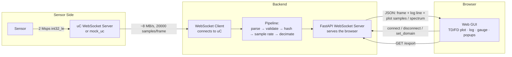
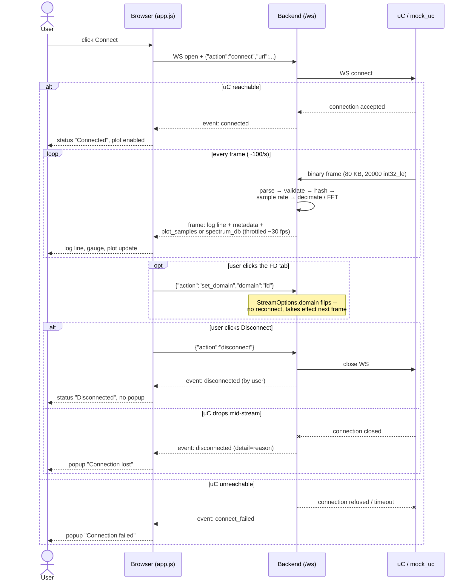

# Architecture

How the pieces fit together and how they behave over time. See the
[main README](../README.md) for how to run the app; this is the deeper dive.

## System overview

The backend acts as a WebSocket **client** to the uC and a WebSocket
**server** to the browser at the same time, on the same `asyncio` event loop:

Each incoming frame goes through a small pipeline of pure, independently
testable steps — parse the raw bytes, validate the sample count, hash the
payload, update the sample-rate estimate, and decimate the signal down to a
plot-friendly point count — before being pushed to the browser as JSON.

Every frame's metadata (log line, hash, validity, sample rate) is forwarded
unconditionally; only the heavy `plot_samples` array is gated by a 30 fps
throttle, so no log entry is ever lost while the plot stays smooth. Recent
frames are kept in a bounded ring buffer, which is what the export endpoint
reads from.

## Connection Lifecycle

The flowchart above shows what flows where; this shows the *order* things
happen in — the part a static diagram of boxes and arrows can't capture,
like why a tab switch doesn't reconnect, and what makes a dropped connection
different from a user-requested disconnect:

One case the diagram leaves out to stay readable: if a second browser tab
opens `/ws` while a stream is already active, the backend replies with a
single `busy` event and closes that socket immediately — the single-client
guard mentioned in the README's
[Design Decisions](../README.md#design-decisions--assumptions), enforced
before any `connect`/`disconnect` command is even read.

## See also

- [GUI Tour](gui-tour.md) — the same lifecycle above, as screenshots of the
  running app: both plot domains, max-hold, and every popup.
- More diagrams (frame-processing pipeline, data model) are planned here as
  the documentation grows.
