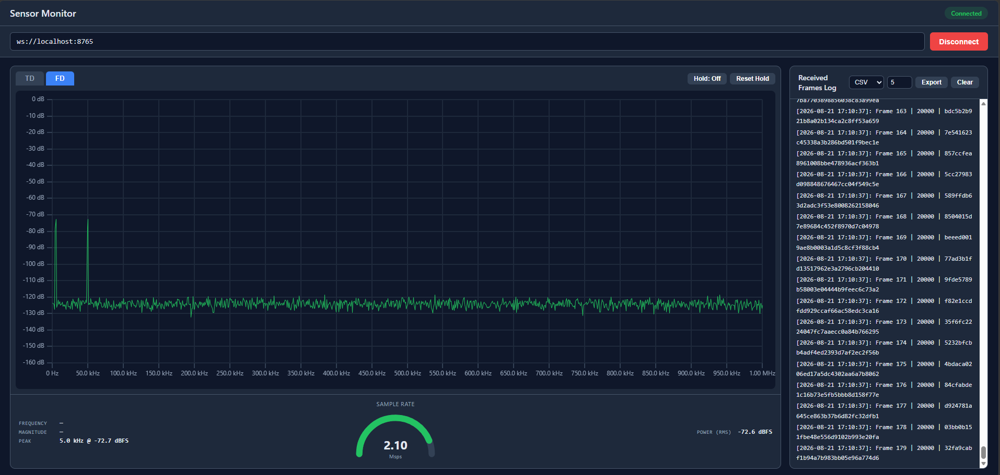
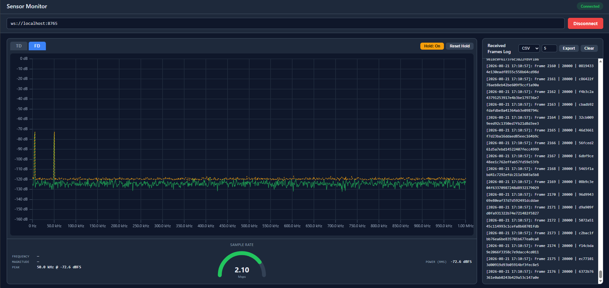
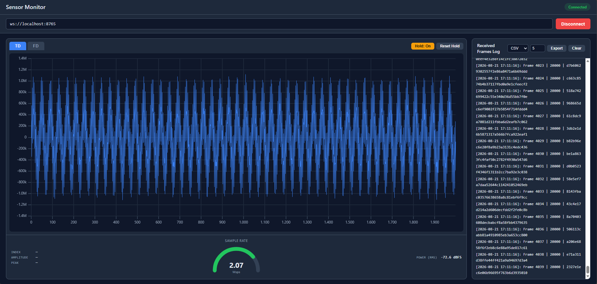
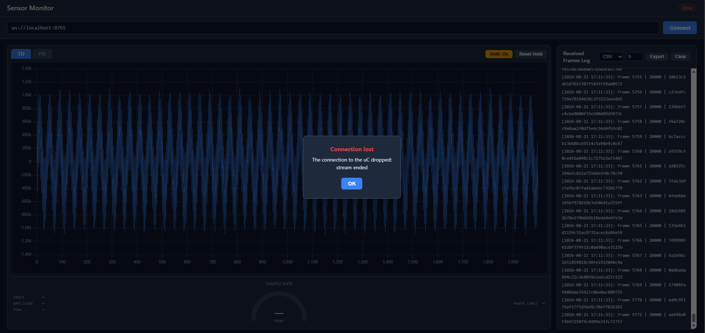
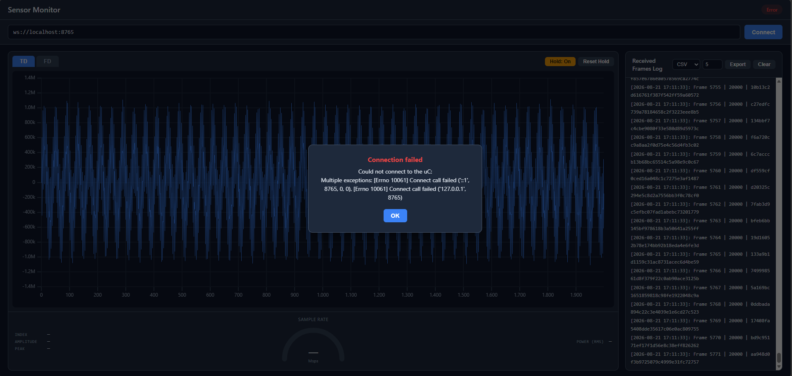
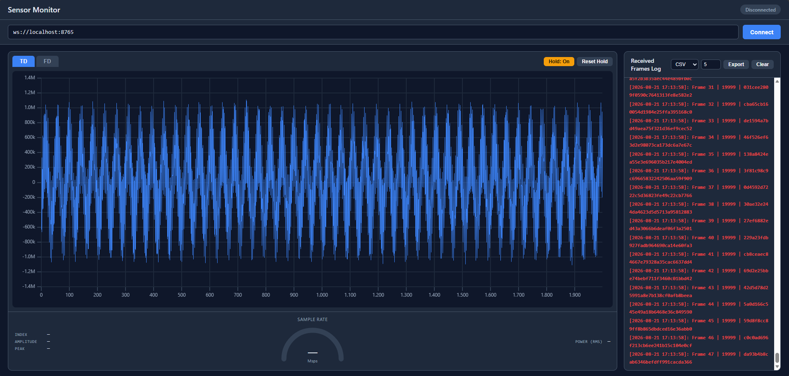

# GUI Tour

Screenshots of the running app, walking through both plot domains, max-hold,
and every connection-lifecycle popup described in
[Architecture](architecture.md#connection-lifecycle). All captured against
`python -m mock_uc.server --fps 100 --port 48765`.

## Frequency domain (FD)

The FD tab shows the FFT spectrum in dBFS against frequency. The mock uC's
two synthetic tones (5 kHz and 50 kHz) stand out clearly above the noise
floor, and the **Peak** read-out below the plot locates the taller of the two
to within one FFT bin:

Turning **Hold** on overlays a dashed amber trace that keeps, per frequency
point, the highest magnitude seen since it was switched on — a spectrum
analyzer's max-hold, useful for catching a transient the live (green) trace
would otherwise miss between frames. Note the peak now reports **50.0 kHz**:
plain per-frame noise briefly made that tone read louder than 5 kHz in the
one frame this was captured on — the point of max-hold is to catch exactly
that kind of transient:

## Time domain (TD)

The TD tab is the default oscilloscope-style view: the raw waveform,
min/max-decimated so the envelope stays intact at ~2000 points per frame
instead of the full 20,000:

Both tabs share the same **Power (RMS)** read-out at the bottom right (in
dBFS, same reference as the spectrum) and the **Sample Rate** gauge in the
center — visible on every screenshot on this page.

## Connection lifecycle

A dropped connection surfaces as a popup and flips the status badge to
**Error**; the log keeps whatever it already had, so nothing already
received is lost:

A connect attempt against a port nobody is listening on fails the same way,
with the underlying socket error included for debugging:

## Invalid-frame validation

Starting the mock with a mismatched sample count
(`python -m mock_uc.server --samples 19999`) exercises the "red log line"
requirement: every frame is still logged, but `is_valid` is `false` and the
line renders in red instead of the default color — no popup, no dropped
connection, just a visibly wrong frame count on every line:

